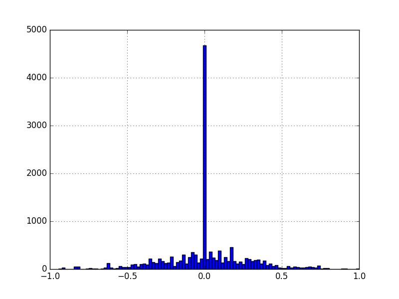
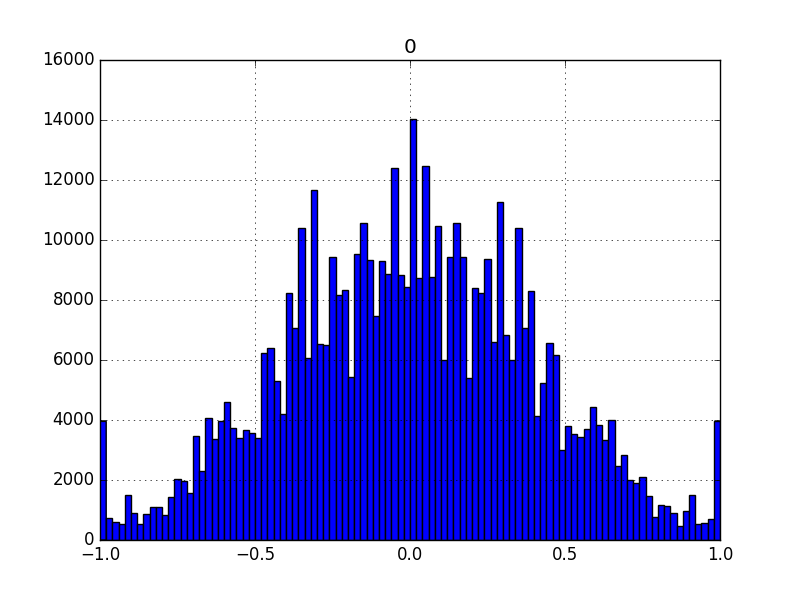

#Behavioral Cloning Project

In this project we were able to use the provided simulator and train our neural net to predit a steering angle based on the input data. Its kind of unbelievable to me that it actually worked out this way and how easy it was to make it learn something that would otherwise be unthinkable :) 

## Bottomline Performance

- Track 1: Car goes around perfectly and infinitely. Car is even able to recover minor nudges while driving :)
- Track 2: Car goes around mostly perfectly till it reaches one particular cliff towards the end and decides to jump off :( 

Model has been generalized with training inputs from both tracks - track 2 performance was achieved without any steering hacks 

Im sure I can fix this with some more training but I feel I've learnt what I wanted to and feel confident to move on to the next project.

##Input preprocessing
This was by far the most important part of the project. The data was heavily biased towards 0 and the model would like to drive the car straight off cliffs. Small problem. Visually inspecting the data reveals the following:


#### Removing 0 bias
My data generator probabilistically rejects 0 valued steering values. It only accepts 5% of them, owing to the fact that they exceed normal data by about a factor of 20. This seems to work well.
```
if (steering_angle == 0. and np.random.uniform() > 0.05):
        continue
```

#### Data Augmentation
To generate more data and generalize the model better - we use flipping and input from the left and right camera. The left and right camera help by generating a large 'view' of the track so the car will be able to recover if it goes slightly offcourse from the training set. Without the left and right cameras - recovery seems to not occur reliably. 
```
      img_choice = np.random.randint(3)
      if img_choice == 0:
          img_path = row.left
          steering_angle += OFF_CENTER_IMG
      elif img_choice == 1:
          img_path = row.center
      else:
          img_path = row.right
          steering_angle -= OFF_CENTER_IMG

      steering_angle = clamp(steering_angle, -1.0, 1.0)\
      
      image = cv2.imread(img_path.strip())
      image = preprocessImage(image, imgsize)
      if (np.random.randint(2) == 0):
        image = cv2.flip(image,1)
        steering_angle = -steering_angle
```
#### Cropping
Cropping the top 60px and the bottom 40px helps generalize the model to track 2 a lot.This is mostly above the horizon so clouds and palm trees anyways :)

#### The end result

We get a beautiful, normally distributed input dataset to our model. This would work well and looks WAY better than what we started with.

## The model

I tried many multiple models to figure out which one works. The models that are included in the model.py file and I tested were:
- My own model based off the keras labs we did. This was quite deep with > 10M parameters!
- Slightly modified nvidia model (https://arxiv.org/abs/1604.07316) 
- A fine tuned VGG16 model.

I found out that the nvidia model was most efficient and worked as well as the other 2 models with much less parameters (~1M). With VGG16 I had to use a very tiny learning rate for it to converge well. For the other 2 a default learning rate of 0.0001 seems to work well. I settled on the nvidia model for this.

To prevent overfitting, I've used a dropout layer after every FC layer. My input data set has about 14554*3*2 (3 cameras + flipping) = 87324 images. I feed this in the model over 50 epochs, each with 10,000 images.

The nvidia model looks as follows in keras:
```
____________________________________________________________________________________________________
Layer (type)                     Output Shape          Param #     Connected to                     
====================================================================================================
convolution2d_1 (Convolution2D)  (None, 24, 80, 24)    1824        convolution2d_input_1[0][0]      
____________________________________________________________________________________________________
convolution2d_2 (Convolution2D)  (None, 12, 40, 36)    21636       convolution2d_1[0][0]            
____________________________________________________________________________________________________
convolution2d_3 (Convolution2D)  (None, 6, 20, 48)     43248       convolution2d_2[0][0]            
____________________________________________________________________________________________________
convolution2d_4 (Convolution2D)  (None, 3, 10, 64)     27712       convolution2d_3[0][0]            
____________________________________________________________________________________________________
convolution2d_5 (Convolution2D)  (None, 2, 5, 64)      36928       convolution2d_4[0][0]            
____________________________________________________________________________________________________
flatten_1 (Flatten)              (None, 640)           0           convolution2d_5[0][0]            
____________________________________________________________________________________________________
dropout_1 (Dropout)              (None, 640)           0           flatten_1[0][0]                  
____________________________________________________________________________________________________
dense_1 (Dense)                  (None, 1164)          746124      dropout_1[0][0]                  
____________________________________________________________________________________________________
dropout_2 (Dropout)              (None, 1164)          0           dense_1[0][0]                    
____________________________________________________________________________________________________
dense_2 (Dense)                  (None, 100)           116500      dropout_2[0][0]                  
____________________________________________________________________________________________________
dropout_3 (Dropout)              (None, 100)           0           dense_2[0][0]                    
____________________________________________________________________________________________________
dense_3 (Dense)                  (None, 60)            6060        dropout_3[0][0]                  
____________________________________________________________________________________________________
dropout_4 (Dropout)              (None, 60)            0           dense_3[0][0]                    
____________________________________________________________________________________________________
dense_4 (Dense)                  (None, 10)            610         dropout_4[0][0]                  
____________________________________________________________________________________________________
dense_5 (Dense)                  (None, 1)             11          dense_4[0][0]                    
====================================================================================================
Total params: 1,000,653
Trainable params: 1,000,653
Non-trainable params: 0
____________________________________________________________________________________________________
```
#### Data Generation
My generator randomly picks out a value from the dataset and proceeds to use it unless its a zero steering value in which case it uses it 5% of the time.
```
      row = drive_log.iloc[np.random.randint(len(drive_log))]
```
#### Validation/Testing
We do use 10% of the data for generating a validation set, but we still use the entire dataset to train the network. Although it seems the absolute number of the loss/val loss may not be that important - I used the validation loss to early stop training and ModelCheckpoint (as suggested by my Udacity reviewer - ty!) to save the best epoch in the run. This makes me early stop the training after like 20 epochs.

```
checkpoint = ModelCheckpoint('model.h5', monitor='val_loss', verbose=1, save_best_only=True, save_weights_only=False, mode='min', period=1)
earlystop = EarlyStopping(monitor='val_loss', min_delta=0.001, patience=3, verbose=1, mode='min')
```

## The approach
I used the udacity data as a 'trusted data source' to debug my code and get my model working. I started by using just a single camera with no augmentation other than flipping. I was able to make the car go around with just that data, given it was balanced properly. I then added on multiple cameras, cropping, more epochs and finally started training on my own track 1 driving data. Eventually I got it to generalize to track 2 by training on 2 laps (one forward, one reverse). 

#### Make sure the generator isn't feeding garbage!
I started off the project with a minor bug in my code which cost me weeks! My generator was shoving out a lot of zero valued X,Y tuples which would obviously force my car to just drive straight all the time! Lesson learnt was to aggresively visualize the output of the generator and visualize the complete set of inputs through the generator to the model. This proved very useful. Adding a global variable to debug the generator is something i'll always be doing from now on!

#### Speed control
To make it work well on track 2 and not fly off cliffs, I had to add a speed limiter and limit the speed to 15. This worked nicely since on low speeds, it would give a high throttle to get the car over cliffs and hills:
```
throttle = max(-1,1 - (speed / 15.0))
```

